# 💥Dimas Hash Table Research💥
## Описание

Это исследование Хэш-Таблицы является частью курсов Системного Программирования в МФТИ.

В нем я хотел исследовать работу Хэш-Таблицы в зависимости от разных Хэш-Функций, а так же я хотел показать, как с помощью знания **ASM x86** можно ускорить ее работу.

## Часть 1. Тест Хэш-Функций

### Zero Hash

Данная Хэш-Функция всегда возвращает 0, несмотря на данные.
Из графика видно, что данная Хэш-функция является не самой лучшей.

Все элементы лежат в 0 ячейке, соответственно, наша Хэш-Таблица работает просто, как двусвязный список. Ни о каком ускорении нет и речи 😞.

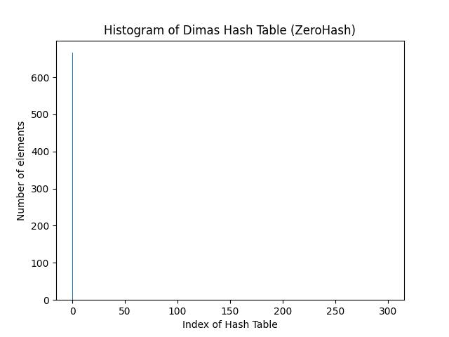

$$ D = 1468,75$$

### Strlen Hash

Данная Хэш-Функция возвращает длину строки подаваемой строки. Т.к. я генерировал строки размером от 3 до 14 символов, то мы видим, что все элементы лежат в этих ячейках.

В силу такого количества коллизий данная Хэш-Функция так же никуда не годится.

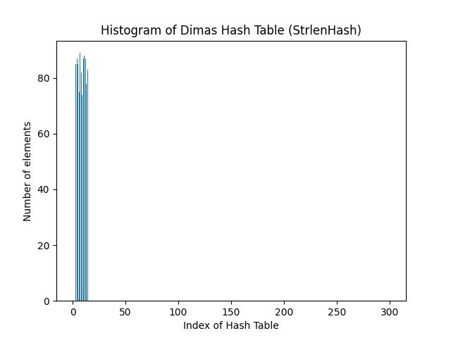

$$ D = 266,87$$

### AsciiCodeSum Hash (301 elem)

Данная Хэш-Функция возвращается Сумму Аски-Кодов всех элементов в строке. Казалось бы, что данная Хэш-Функция обладает маленькой дисперсией и значит пригодна для использования. Но давайте рассмотрим эту же Хэш-Функцию на 101 элементе.

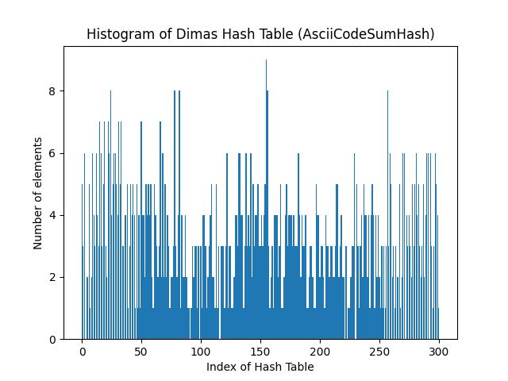

$$ D = 3,23 $$

### AsciiCodeSum Hash (101 elem)

Здесь уже видно, что дисперсия значительно увеличилась.

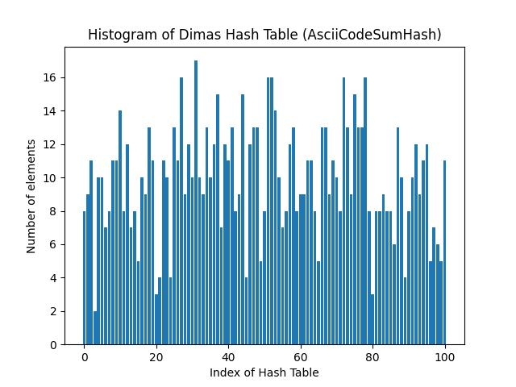

$$ D = 11,49 $$

### Dimas Hash

*Моя авторская Хэш-Функция*, основанная на битовых сдвигах. Работает неплохо 🤠.

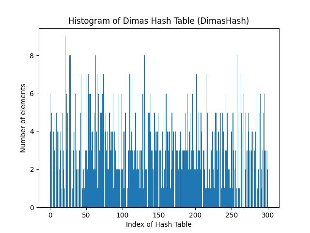

$$ D = 3,5 $$

### CRC32 Hash

Хэш-Функция **CRC32**.
Пожалуй, лучший выбор из всех имеющихся Хэш-Функций, обладающая минимальной дисперсией.

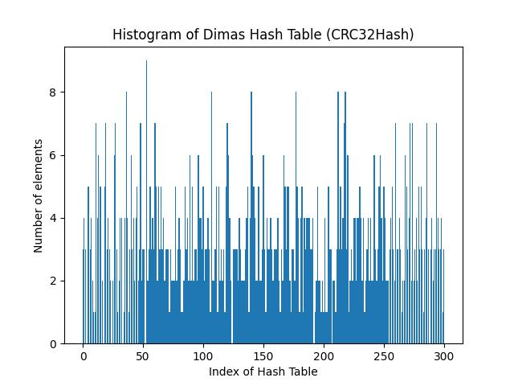

$$ D = 3,13 $$

## Часть 2. Ускорение Хэш-Таблицы

Далее, попробуем оптимизировать Хэш-Таблицу, используя 3 различных способа: **Ускорение Intrinsic'ами**, **ускорение ASM вставками**, **ускорение внешним ASM**.

### Ускорение Intrinsic'ами

Используя **профилировщик** Visual Studio, найдем самые затратные для процессора функции. Видно, что на первом месте стоит наша Хэш-Функция CRC32.

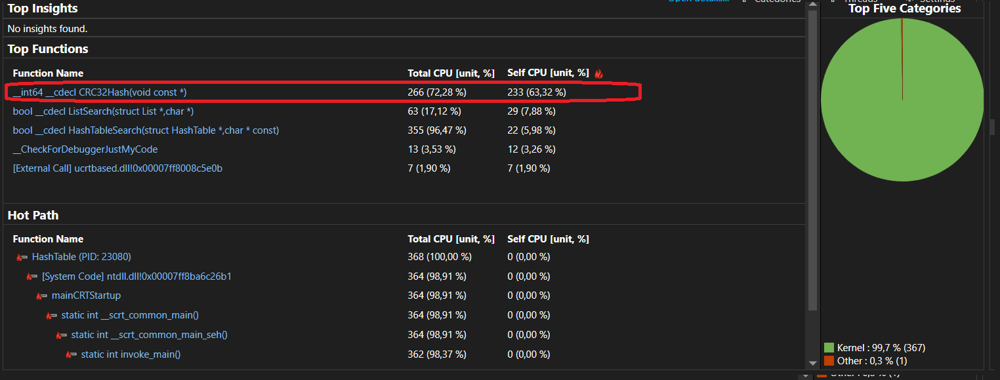

Есть возможность, оптимизировать Хэш-Функцию **CRC32** Intrinsic-функциями, т.к. есть функция **_mm_crc32_u64**, реализующая алгоритм CRC32, ускоряя его в разы.

Код Оптимизированной **CRC32**:

```c
Hash_t OptCRC32Hash(const void* value)
{
    assert(value != nullptr);

    uint32_t hash = 0;

    // String Is No Longer than 16 symbs
    hash = _mm_crc32_u64(hash, *((uint64_t*)value));
    hash = _mm_crc32_u64(hash, *((uint64_t*)value + 1));

    return hash;
}
```

|     **N измерения**     |    **1**   |   **2**   |   **3**   |   **4**   |   **5**   | **Среднее Значение**         |
|:-----------------------:|:----------:|:---------:|:---------:|:---------:|:---------:|--------------------------|
| **N тактов CPU, NoOpt** | 638654970 | 634839625 | 633680220 | 629611837 | 631935593 |$ 633744449 $|
|  **N тактов CPU, Opt**  |  117355890 | 117101010 | 115416420 | 123148207 | 120731130 | $ 118750531 $ |

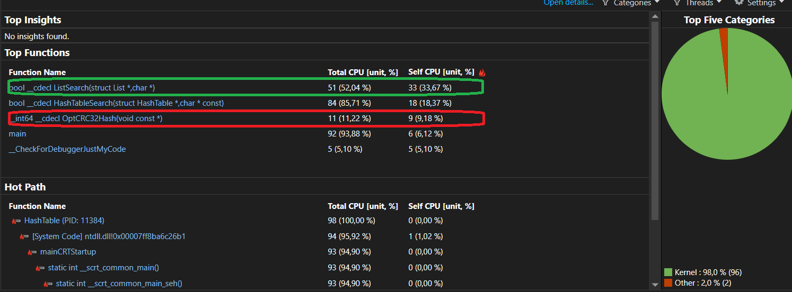

Оптимизировали в **5,32** раз!

### Ускорение ASM вставкой

Далее видим, что самая затратная функция в коде ListSearch - это **strcmp**. Попробуем оптимизировать strcmp, используя ASM - вставку.

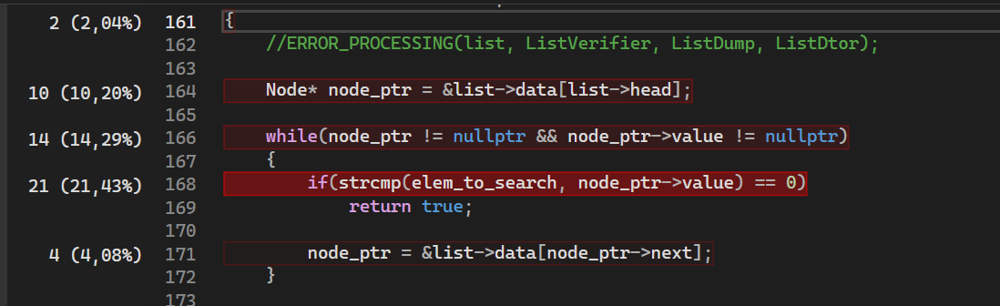

|     **N измерения**     |    **1**   |   **2**   |   **3**   |   **4**   |   **5**   | **Среднее Значение**         |
|:-----------------------:|:----------:|:---------:|:---------:|:---------:|:---------:|--------------------------|
|  **N тактов CPU, NoOpt**  |  117355890 | 117101010 | 115416420 | 123148207 | 120731130 | $ 118750531 $ |
| **N тактов CPU, Opt** | 57163370 | 57114770 | 57355670 | 57670370 | 57554930 |$ 57371822 $|

Оптимизированная **strcmp**:

```c
static inline int OptStrCmp(const char* str1, const char* str2)
{
    assert(str1 != nullptr);
    assert(str2 != nullptr);

    int result = 0;

    __asm__ inline (
        ".intel_syntax noprefix\n\t"
        "vlddqu ymm1, [%1]\n\t"
        "vptest ymm1, [%2]\n\t"

        "setc %b0\n\t"

        : "+r" (result)
        : "r" (str1), "r" (str2)
    );

    return result;
}

```

Оптимизировали в **2.06** раза!

### Ускорение внешним ASM

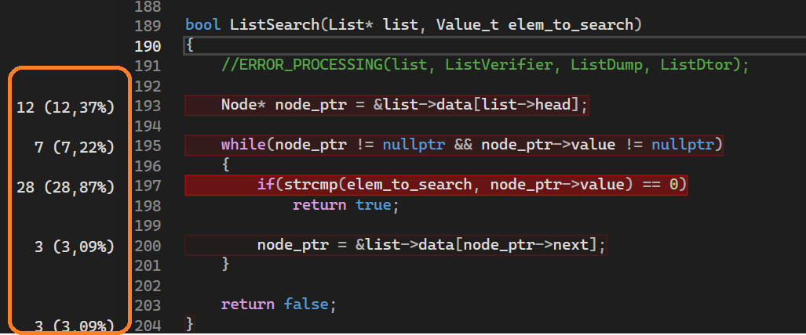

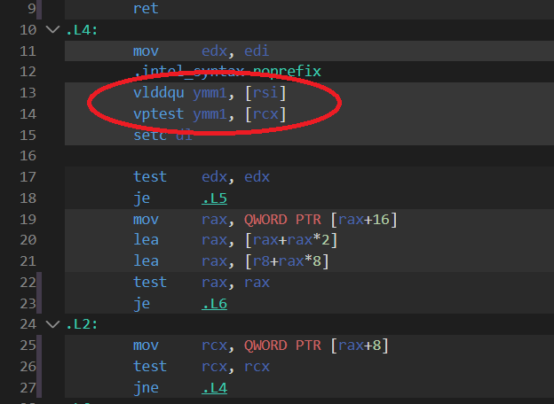


|     **N измерения**     |    **1**   |   **2**   |   **3**   |   **4**   |   **5**   | **Среднее Значение**         |
|:-----------------------:|:----------:|:---------:|:---------:|:---------:|:---------:|--------------------------|
| **N тактов CPU, NoOpt** | 57163370 | 57114770 | 57355670 | 57670370 | 57554930 |$ 57371822 $|
| **N тактов CPU, Opt** | 55891860 | 55950510 | 56370300 | 55679250 | 55847100 |$ 55947804 $|

Оптимизировали в **1.02** раз!

💘 **Dmit DREC MIPT 2024**
